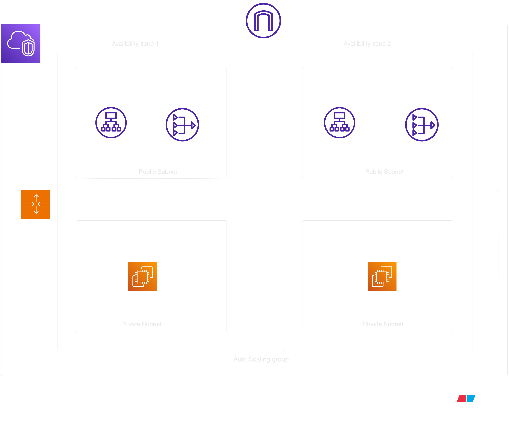

<p align="center">
  
</p>

## Infrastructure Provisioning Guide

This repository contains Terraform code to provision **infrastructure on AWS**.
The setup includes networking components, compute instances, and a load balancer to host and expose an
application.

------------------------------------------------------------------------

## Prerequisites

Before provisioning the infrastructure, ensure the following tools are
installed and configured on your system:

-   **AWS CLI**
-   **Terraform**
-   **Git**

You must also have an **AWS account with sufficient permissions** to
create resources such as: - VPC - EC2 Instances - Load Balancer - Auto
Scaling Groups - Security Groups and other networking components

------------------------------------------------------------------------

## Configure AWS CLI

If AWS CLI is not already configured, run:

``` bash
aws configure
```

Provide the following details when prompted:

-   AWS Access Key ID
-   AWS Secret Access Key
-   Default Region (example: `ap-south-1`)
-   Default Output Format (`json` recommended)

------------------------------------------------------------------------

## Clone the Repository

Clone the project repository and navigate into the project directory.

``` bash
git clone https://github.com/VirajDalave/Terraform.git
cd Two-Tier\ demo\ project/
```

------------------------------------------------------------------------

## Initialize Terraform

Initialize Terraform to download the required providers and modules.

``` bash
terraform init
```

------------------------------------------------------------------------

## Configuration

Review the Terraform configuration files and modify them if required
based on your application needs.

Common configuration changes may include:

-   AWS region
-   Instance types
-   AMI IDs
-   Networking configuration
-   Application-specific settings

------------------------------------------------------------------------

## Provision the Infrastructure

Run the following command to create the infrastructure:

``` bash
terraform apply --auto-approve
```

Terraform will provision all the resources defined in the configuration.

------------------------------------------------------------------------

## Verify Deployment

After the infrastructure is successfully created:

1.  Check the Terraform output values.
2.  Use the **Load Balancer DNS** to access your application.

------------------------------------------------------------------------

## Destroy Infrastructure

To delete all resources created by Terraform:

``` bash
terraform destroy --auto-approve
```

This will safely remove all infrastructure managed by Terraform in this
project.

------------------------------------------------------------------------

## Notes

-   Ensure your AWS credentials have sufficient permissions.
-   Review Terraform plans before applying changes in production
    environments.
-   Avoid committing sensitive data such as access keys to version
    control.
